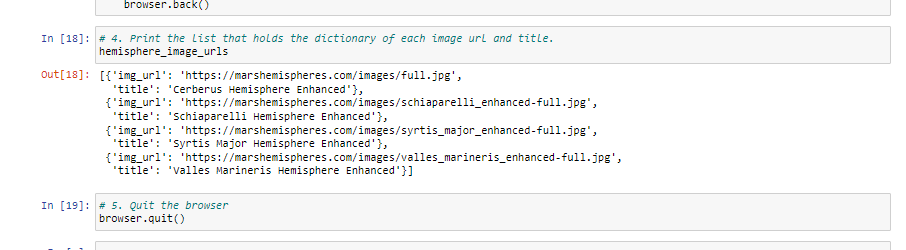

# Mission_to_Mars
Splinter,webdriver_manager,beautifulsoup,mongodb

### Overview & Purpose

This project has been undertaken on behalf of Robin, a junior data scientist, who does freelance astronomy work in her spare time. Her dream is to land a position with NASA someday. So she spends a lot of time visiting news about space exploration, especially the Mission To Mars. Therefore, Web Scraping technique was used to gather and store the latest data. Web Scraping has the ability to pull data from multiple websites,store it in a database and then present the collected data in a central location.
In this module, the following tools have been used -

- Splinter
- DevTools
- BeautifulSoup
- ChromeDriverManager
- MongoDB-no SQL database to store the data
- Flask for building the framework for the app using Flask and Mongo together
- Jupyter Notebook
- VS Code

## Deliverable 1

Using BeautifulSoup and Splinter, you’ll scrape full-resolution images of Mars’s hemispheres and the titles of those images.

